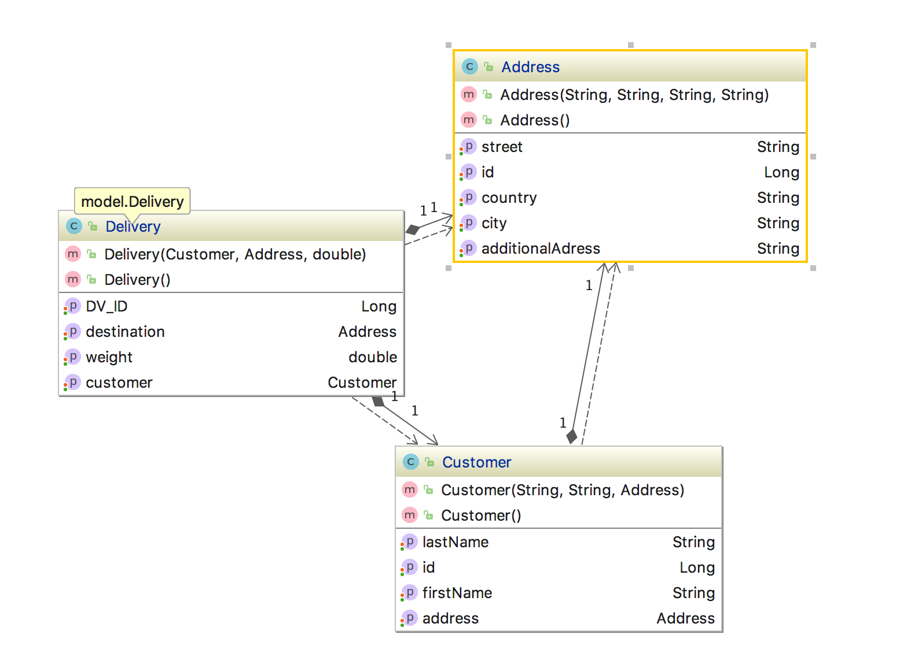

# Mini Projekt - NVS
Im Rahmen des NVS Unterrichtest, besteht die Aufgabe darin ein Mini-Projekt zu einem Thema zu programmieren.

Dabei müssen folgende Aufgaben erfüllt werden:

- Ein Git-Repo am Github für das Projekt
- ERD erstellen
- Junit Tests

## Mein Beta-ERD

