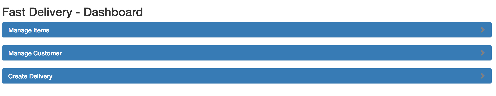
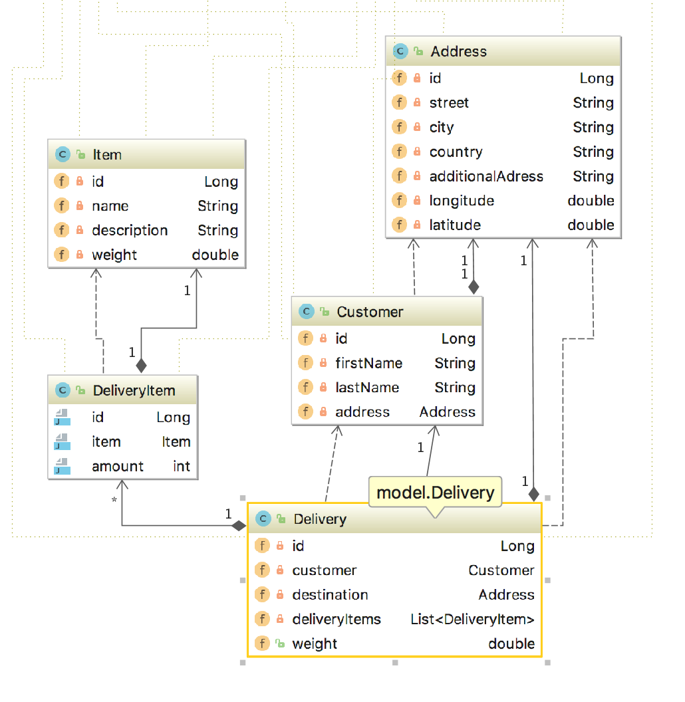
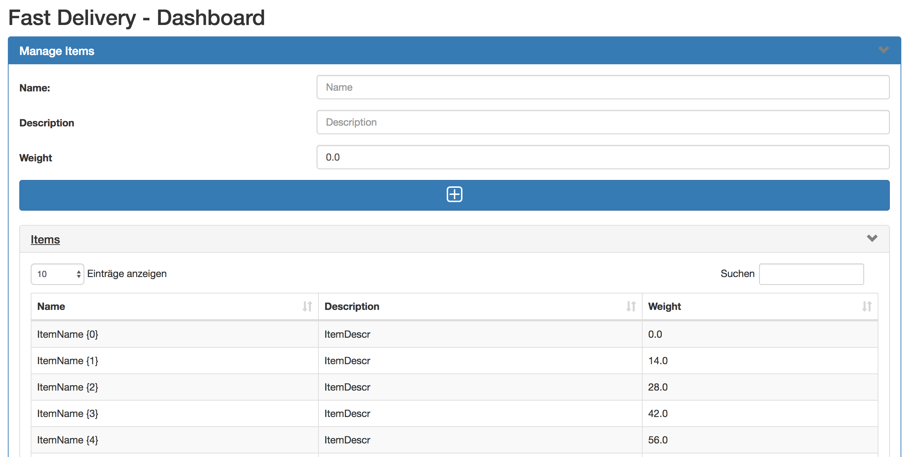
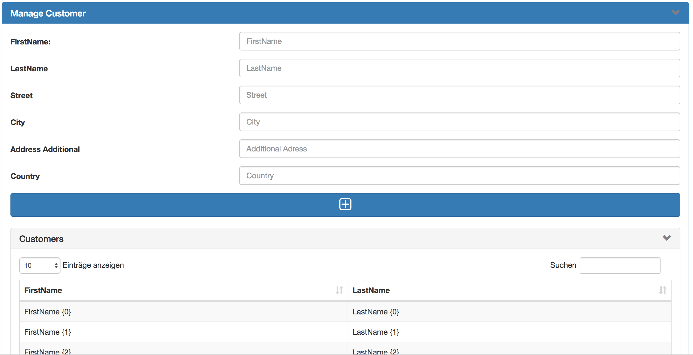

# Mini Projekt - NVS
Im Rahmen des NVS Unterrichtest, besteht die Aufgabe darin ein Mini-Projekt zu einem Thema zu programmieren.

## Info
Es wird eine MySQL - Datenbank verwendet:

``` 
<jta-data-source>java:/mysql</jta-data-source> 
```

Die Website ist unter localhost:8080/mini/ zu erreichen!

## Aufgabe

Lieferdienst - Unternehmen! Es sollen Kunden, Waren- & Aufträge verwaltet werden können. 

Die Website ist in 3 Komponenten eingeteilt:
 - Warenverwaltung mit sortieren und globaler suche
 - Kundenverwaltung mit sortieren und globeler suche
 - Auftragserstellung

Alle 3 Komponenten können über ein Panel auf und zugeklappt werden

 

## ERD

 

## Warenverwaltung:


Es können Waren angelegt werden mit einem Name, einer Beschreibung und einem Gewicht.

## Kundenverwaltung:




## Auftragsverwaltung:

Bei der Auftragserstellung kann ein Kunde ausgewählt, dann die Ware die befördert werden soll hinzugefügt und dann noch das Ziel der Lieferung eingegeben werden.


## Auftragsansicht

Es gibt eine weitere Seite (localhost:8080/mini/manage.xhtml) die eine Liste aller Aufträge anzeigt und bei Auswählen einen Mark in einer Google Maps anzeigt! (NOCH NICHT IMPLEMENTIERT)